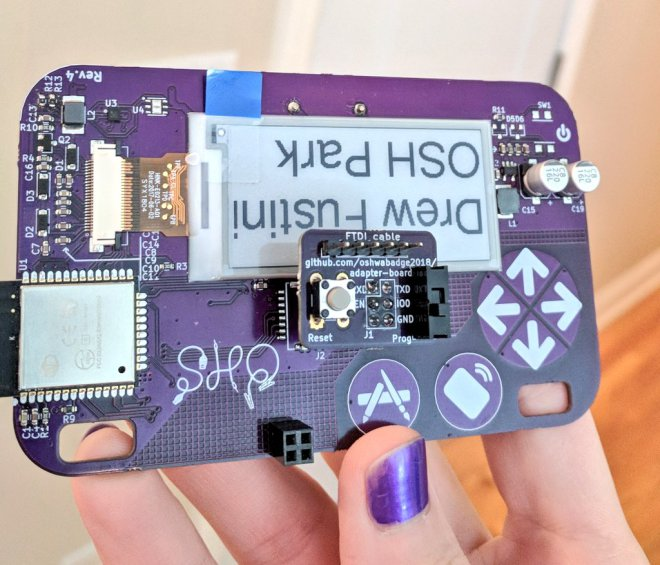
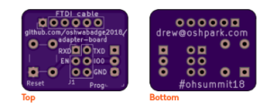
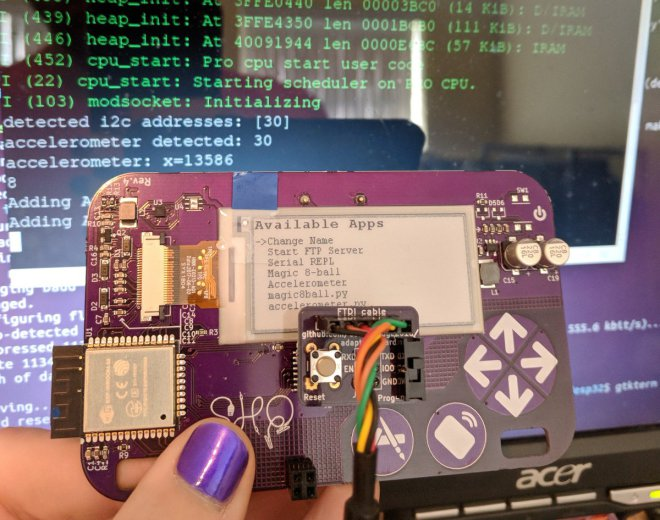

## Adapter board for USB-to-serial cable
adapter board to connect USB-to-serial cable to J1 header on Open Hardware Summit badge

### [OSH Park shared project](https://oshpark.com/shared_projects/39CXLX65)
Order the PCB from OSH Park:

[Adapter board for USB-to-serial cable](https://oshpark.com/shared_projects/39CXLX65)

### [Blog post](http://blog.oshpark.com/2018/10/19/adapter-board-for-open-hardware-summit-badge/)
[Adapter board for Open Hardware Summit badge](http://blog.oshpark.com/2018/10/19/adapter-board-for-open-hardware-summit-badge/)
> The badge features an ESP32 microcontroller running MicroPython firmware.  The firmware provides a Python interpreter prompt (REPL) on the serial port which allows interactive programming of the badge!

### Bill of Materials (BoM)
* **[Digi-Key shopping cart](https://www.digikey.com/short/jdb477)**

* Switch for programming mode
  * E-Switch EG1218
  * Slide Switch SPDT
  * Digi-Key: [EG1903-ND](https://www.digikey.com/short/jdmjh3)

* Pushbutton for reset
  * Omron B3F-1000
  * Tactile Switch SPST-NO
  * Digi-Key: [SW400-ND](https://www.digikey.com/short/jdmjhz)

* Header for FTDI usb-to-serial cable
  * TE AMP 9-146282-0-06
  * 1x6 Pin Header 0.1" pitch
  * Digi-Key: [A34253-06-ND](https://www.digikey.com/short/jdmjhd)

* Header to connect J1 socket on badge
  * Harwin M20-9720345
  * 2x3 Pin Header 0.1" pitch
  * Digi-Key: [952-1921-ND](https://www.digikey.com/short/jdmj9p)
  
* J1 header socket on the badge
  * Harwin 952-1781-ND
  * 2x3 Header Socket  0.1" pitch
  * Digi-Key: [M20-7830346](https://www.digikey.com/short/jdbtfc)

